<!--
  ____________________________________________________________
  🏛️ AI-Powered OCR for Regional Documents
  ____________________________________________________________
-->

[](LICENSE)  
[](https://www.python.org/)  
[](https://www.raspberrypi.org/)  

# 🎨 AI-Powered OCR Solution for Digitizing Historical Documents in Regional Languages
**Preserve cultural heritage by transforming fragile manuscripts into searchable, self-improving digital text.**

---

## 🛑 Problem Statement

Digitizing historical and regional language documents presents a multifaceted challenge that encompasses material degradation, diverse scripts, and limited automation tools. Without intervention, invaluable manuscripts—ranging from palm-leaf inscriptions to colonial-era correspondence—risk irreversible loss.

### 1. Background & Context
- **Cultural Assets at Risk**: Many archives, temples, and private collections across India and Southeast Asia hold handwritten records in scripts such as Tamil, Malayalam, Kannada, Telugu, and more. Exposure to humidity, pests, and mechanical wear causes pages to fade, tear, and disintegrate.
- **Academic Barriers**: Scholars in linguistics, history, and anthropology require searchable, machine-readable text to perform corpus analysis, frequency studies, and semantic research. Manual transcription is time-consuming and error-prone.

### 2. Key Challenges
1. **Script Complexity**: Regional languages often feature ligatures, diacritics, and cursive forms that standard Latin-based OCR engines cannot decode accurately.
2. **Handwriting Variability**: Historic manuscripts exhibit wide stylistic variation—ink density fluctuations, non-uniform letter spacing, and author-specific flourishes.
3. **Physical Degradation**: Stains, bleed-through, and faded ink introduce noise that complicates image preprocessing and text segmentation.
4. **Resource Constraints**: Rural or underfunded archives lack high-end servers or cloud connectivity; solutions must run on low-cost, low-power devices.

### 3. Requirements for an Effective Solution
- **High Accuracy**: Achieve less than 10% Character Error Rate (CER) even on degraded, handwritten samples.
- **Offline Operation**: Perform both inference and model retraining without internet access to accommodate remote usage.
- **Self-Improving**: Incorporate user corrections to fine-tune the model automatically, reducing dependence on expert annotators.
- **Extensible Architecture**: Modular design that allows addition of new scripts, preprocessing steps, and model architectures with minimal rework.
- **User-Friendly Interface**: Enable non-technical archivists and researchers to upload scans, review OCR output, and provide corrections via an intuitive web UI.

---

## 📖 Table of Contents
1. [✨ Executive Summary](#-executive-summary)
2. [🌍 Motivation & Impact](#-motivation--impact)
3. [🎯 Objectives](#-objectives)
4. [🏗️ System Architecture](#-system-architecture)
5. [🔧 Core Components](#-core-components)
   - [5.1 User Interface](#51-user-interface)
   - [5.2 API Gateway & Routing](#52-api-gateway--routing)
   - [5.3 Preprocessing Module](#53-preprocessing-module)
   - [5.4 OCR Engines](#54-ocr-engines)
   - [5.5 Postprocessing & Correction UI](#55-postprocessing--correction-ui)
   - [5.6 Self-Retraining Pipeline](#56-self-retraining-pipeline)
   - [5.7 Model Hosting & Deployment](#57-model-hosting--deployment)
   - [5.8 Data Storage & Logging](#58-data-storage--logging)
6. [⚙️ Technology Stack & Rationale](#-technology-stack--rationale)
7. [📝 Detailed Workflow](#-detailed-workflow)
8. [📊 Data Flow & Sequence Diagrams](#-data-flow--sequence-diagrams)
9. [📡 API Reference](#-api-reference)
10. [🚀 Installation & Deployment](#-installation--deployment)
11. [🖥️ Hardware Setup (Raspberry Pi)](#️-hardware-setup-raspberry-pi)
12. [🔍 Performance Benchmarks & Profiling](#-performance-benchmarks--profiling)
13. [🔒 Security & Privacy](#-security--privacy)
14. [🎓 Educational Outcomes](#-educational-outcomes)
15. [❓ Troubleshooting & FAQs](#-troubleshooting--faqs)
16. [📈 Roadmap & Future Work](#-roadmap--future-work)
17. [🤝 Contributing Guide](#-contributing-guide)
18. [📜 License](#-license)
19. [🙏 Acknowledgements](#-acknowledgements)
20. [📎 Appendix & Glossary](#-appendix--glossary)

---

## ✨ Executive Summary
> **Bring history to life** by digitizing fragile manuscripts and cultural texts using a **self-learning**, **edge-deployable** OCR solution. Running entirely on a Raspberry Pi, the system continuously improves its accuracy through user feedback, ensuring high fidelity for complex scripts like Tamil and beyond.

**Key Highlights:**
- **Offline-first**: Zero dependency on cloud during inference or retraining.  
- **Self-retraining**: Active learning loop triggered by user corrections.  
- **Multi-script support**: Latin (English) & complex regional scripts.  
- **Educational platform**: Hands-on AI, embedded systems, and DevOps.

---

## 🌍 Motivation & Impact
> _"Preserving our past empowers our future."_

1. **Cultural Preservation**: Manuscripts, palm leaf scripts, and historic letters often suffer decay. Digitization safeguards these treasures for posterity.  
2. **Research Democratization**: Academics worldwide can search and analyze texts without physical access.  
3. **Skill Building**: ECE students gain practical exposure to AI, edge computing, and CI/CD pipelines.  
4. **Community Growth**: Crowdsourced corrections drive federated learning—enhancing recognition for under-resourced languages.

---

## 🎯 Objectives
- **Accuracy**: Achieve <10% Character Error Rate (CER) on printed and handwritten regional scripts.  
- **Scalability**: Support incremental addition of new languages/models.  
- **Autonomy**: Fully automated retraining pipeline on Raspberry Pi, minimizing manual intervention.  
- **User Experience**: Intuitive UI with inline corrections and real-time feedback.

---

## 🏗️ System Architecture

```mermaid
flowchart LR
    subgraph User
      U[User Interface]
    end
    subgraph Edge
      PI[📟 Raspberry Pi]
      Pre[🔍 Preprocessor]
      OCR[🤖 OCR Engine]
      Retrain[🔄 Retraining]
    end
    subgraph Cloud
      HF[☁️ Hugging Face Hub]
    end
    U --> |Upload| API[🚪 API Gateway]
    API --> |Route| OCR
    OCR --> |Results| U
    U --> |Corrections| API
    API --> |Log| PI
    PI --> |Trigger| Retrain
    Retrain --> |Upload Model| HF
    HF --> |Polls & Updates| PI
```

<details>
<summary>📂 Click to expand architecture overview</summary>



</details>

**Description:**  
1. **User Interface** sends scans to the **API Gateway**.  
2. Gateway routes to either the **Node.js** (Latin) or **FastAPI** (Regional) OCR engine.  
3. Inference runs on the **Pi**; results return to the UI.  
4. User corrections feed back into a log.  
5. Once thresholds met, the Pi retrains the model locally, packages a new version, and uploads to Hugging Face.  
6. All Pi devices poll the hub, download updates, and hot-swap models in real-time.

---

## 🔧 Core Components

### 5.1 User Interface
- **Framework**: React + Tailwind CSS  
- **Key Features**:
  - Drag-and-drop upload area  
  - Language selector with auto-detect toggle  
  - Overlay rendering of bounding boxes on original image  
  - Inline editable text panels with color-coded confidence highlights  
  - Progress bars for upload, inference, and retraining jobs

> 💡 *Tip:* Use [react-dropzone](https://react-dropzone.js.org/) for drag-and-drop file uploads.


### 5.2 API Gateway & Routing
- **Stack Options**: Nginx as reverse proxy + uWSGI, or FastAPI as unified gateway  
- **Responsibilities**:
  - Route `/upload` and `/ocr` endpoints based on `language` param  
  - Enforce size and type limits  
  - Authenticate admin operations (model upload) via JWT  
  - Rate-limit client requests to prevent abuse

> ⚠️ *Security Note:* Always validate `Content-Type` and reject unexpected media types (return 415).


### 5.3 Preprocessing Module

| Step            | Technique                            | Purpose                                           |
|-----------------|--------------------------------------|---------------------------------------------------|
| **Denoising**   | Non-local Means / DNN Denoiser       | Remove scan noise & artifacts                     |
| **Deskewing**   | Hough Line Transform                 | Correct page rotation                             |
| **Enhancement** | CLAHE (Adaptive Histogram Equalization) | Boost faded ink contrast                          |
| **Thresholding**| Otsu’s method                        | Convert to binary for segmentation                |
| **Segmentation**| MSER / Connected Components          | Extract text blocks, lines, words                 |

> 📌 *Pro Tip:* Preprocessing directly affects OCR accuracy—fine-tune parameters per script.


### 5.4 OCR Engines

#### • English/Latin: Llama OCR (Tesseract.js)
- **Pros**: Fast, robust for printed fonts  
- **Invocation**:
  ```typescript
  import { recognize } from 'tesseract.js';
  const { data } = await recognize(filePath, 'eng');
  ```

#### • Regional (e.g., Tamil): Custom PyTorch Model
- **Architecture**:
  1. **CNN** layers for visual feature extraction  
  2. **Bidirectional LSTM** for sequence modeling  
  3. **CTC Loss** for alignment without segmentation labels
- **Training Data**: Mix of synthetic generated text images + real scans  
- **Inference** via FastAPI endpoint:
  ```python
  @app.post("/ocr/tamil")
  async def ocr_tamil(file: UploadFile):
      img = preprocess(await file.read())
      logits = model(img)
      text = ctc_decode(logits)
      return {"text": text}
  ```

> 🚀 *Performance Tip:* Use TorchScript to optimize model for ARM by tracing.


### 5.5 Postprocessing & Correction UI
- **Spellcheck**: Integrate [Hunspell](https://github.com/blatinier/hunspell-js) for suggestion lists  
- **Language Model Refinement**: Use n-grams or a small Transformer to re-rank ambiguous results  
- **UI UX**: Highlight low-confidence words in red and pop up suggestions on hover.  
- **Logging**: Save `(image_id, orig_text, corr_text, user_id, timestamp)` in JSON Lines format.

> 🖊️ *UX Insight:* Immediate inline correction reduces user friction and increases data quality.


### 5.6 Self-Retraining Pipeline
1. **Monitor**: Watch `corrections.jsonl` for new entries.  
2. **Threshold Check**: If >N corrections for a language, schedule retraining.  
3. **Data Preparation**: Combine corrected pairs, apply augmentation (rotate ±5°, blur, noise).  
4. **Fine-Tuning**:
   ```bash
   python train.py \
     --data-dir data/corrections \
     --epochs 5 \
     --batch 4 \
     --lr 1e-4
   ```
5. **Validation**: Evaluate CER/WER; only promote if improved.  
6. **Version & Upload**: Tag `ocr-tamil-v2.3`, upload to Hugging Face via CLI.

> 📅 *Scheduler:* Use `cron` or `APScheduler` to run checks every midnight.


### 5.7 Model Hosting & Deployment
To showcase our on-device training capability and provide seamless access to the latest OCR models, we utilize Hugging Face Model Hub as our distribution platform.

1. **Dedicated Model Repositories**  
   - Each new model version (e.g., `ocr-tamil-v2.4`) is created as a private HF repo containing:
     - `model.pt` (TorchScript file)
     - `config.json` (with `architecture`, `version`, `CER`, `training_date`, and `data_stats`)
     - `README.md` (model description, training logs, and usage instructions)
     - `validation_samples/` (representative scans with ground-truth for QA)

2. **Automated CI/CD on GitHub**  
   - A GitHub Actions workflow triggers on `tags` or manual dispatch:
     ```yaml
     name: Deploy OCR Model
     on:
       push:
         tags:
           - 'v2.*'
     jobs:
       deploy:
         runs-on: ubuntu-latest
         steps:
           - uses: actions/checkout@v3
           - uses: actions/setup-python@v4
             with: python-version: '3.10'
           - run: pip install huggingface-hub
           - run: |
               huggingface-cli login --token ${{ secrets.HF_TOKEN }}
               hf repo create ocr-tamil-${{ github.ref_name }} --private
               git init models/ocr-tamil-${{ github.ref_name }}
               cd models/ocr-tamil-${{ github.ref_name }}
               git remote add origin https://huggingface.co/your-org/ocr-tamil-${{ github.ref_name }}
               git add . && git commit -m "Release OCR Tamil ${{ github.ref_name }}"
               git push origin main
     ```

3. **Edge Synchronization Service**  
   - On each Pi, a `model_sync.py` script runs as a systemd service:
     ```python
     import requests, hashlib, time
     while True:
         meta = requests.get(f"https://huggingface.co/your-org/ocr-tamil/latest/config.json").json()
         if meta['version'] != local_version:
             model_data = requests.get(meta['download_url']).content
             if hashlib.sha256(model_data).hexdigest() == meta['checksum']:
                 with open('models/current.pt','wb') as f: f.write(model_data)
                 reload_model('models/current.pt')
         time.sleep(21600)  # 6 hours
     ```

4. **Hot-Swap & Rollback**  
   - New models are loaded into memory without stopping FastAPI: use Python’s `importlib.reload` or maintain a model manager class.  
   - If health-check (small sample inference) fails post-swap, revert `models/backup/previous.pt` as current and log alerts.

> 🔄 *Visibility:* Staff can verify model versions and training metrics directly on the Hugging Face website, ensuring full transparency of our bespoke Raspberry Pi-driven training pipeline.

### 5.8 Data Storage & Logging
- **Uploads**: `/data/uploads/{user_id}/{image_id}.png`  
- **Corrections**: `/data/logs/corrections.jsonl`  
- **Database (Optional)**: SQLite DB storing metadata: users, sessions, images, models.  
- **Log Rotation**: Use `logrotate` to compress archives weekly.

> 🔍 *Auditability:* Retain logs for ≥6 months to support research reproducibility.

---

## ⚙️ Technology Stack & Rationale
| Layer              | Technology             | Purpose                                                |
|--------------------|------------------------|--------------------------------------------------------|
| **Frontend**       | React + Tailwind CSS   | Fast UI iteration, responsive design                  |
| **API Gateway**    | FastAPI / Nginx        | High throughput routing, SSL termination               |
| **Latin OCR**      | Tesseract.js (Llama)   | Low-latency, accurate for printed text                 |
| **Regional OCR**   | PyTorch 2.0            | Flexible architecture for custom models               |
| **Preprocessing**  | OpenCV, Pillow         | Industry-standard image transformations                |
| **Storage**        | FS / SQLite            | Minimal ops overhead, local-first data retention       |
| **Model Hub**      | Hugging Face           | Version control, distribution, access control          |
| **CI/CD**          | GitHub Actions         | Automated testing, packaging, deployment              |
| **Hardware**       | Raspberry Pi 4 (4/8GB) | Affordable edge compute, ARM architecture             |

---

## 📝 Detailed Workflow
> Expand each step with code snippets, command examples, and best practices.

### 7.1 Document Upload & Validation
1. **Client Preview**: Display thumbnail & metadata.  
2. **Client Validation**: Reject >10MB or unsupported types.  
3. **Server Endpoint**:
   ```python
   @app.post("/upload")
   async def upload(file: UploadFile, lang: str = "auto"):
       validate_file(file)
       image_id = uuid4().hex
       save_path = f"{DATA_DIR}/{image_id}.{ext}"
       await write_file(file, save_path)
       return await route_to_ocr(save_path, lang)
   ```

### 7.2 Language Detection & Routing
- **Auto-Detect**: Simple Unicode block analysis:
  ```python
  import unicodedata
  def detect_language(text_sample):
      for ch in text_sample[:100]:
          if 'TAMIL' in unicodedata.name(ch):
              return 'tam'
      return 'eng'
  ```
- **Routing Logic**:
  ```python
  if lang in ['eng', 'Latin']:
      result = await ocr_latin(path)
  else:
      result = await ocr_tamil(path)
  ```

### 7.3 Image Preprocessing Steps
(See Section 5.3 for summary table.)  
_Note: Parameterize filters via config file for easy tuning._

### 7.4 OCR Inference Engines
(See Section 5.4 for code snippets.)  
_Add GPU fallback on Pi cluster if available._

### 7.5 Result Aggregation & Display
- Combine blocks, reflow paragraphs, maintain reading order using spatial coordinates.  
- Highlight low-confidence zones in the UI.

### 7.6 User Feedback Logging
- Append to JSONL with atomic file writes to avoid corruption.  
- Example entry:
```json
{"image_id":"abc123","orig":"...","corr":"...","user":"anon","ts":"2025-04-26T21:00:00+05:30"}
```

### 7.7 Retraining Trigger Conditions
- Scheduled job checks:
  ```bash
  schedule: 0 2 * * * python check_retrain.py
  ```

### 7.8 Retraining Workflow
- Use `torch.utils.data.Dataset` and `DataLoader` for lazy loading.  
- Save best model via `torch.save(model.state_dict(), path)`.

### 7.9 Versioning & Rollback
- Maintain a `versions.json` manifest with `current`, `previous` entries.  
- On Pi:
  ```bash
  hf model pull ocr-tamil-v2.3 && mv model.pt current && rm -rf previous && ln -s current previous
  ```

---

## 📊 Data Flow & Sequence Diagrams
<details>
<summary>Mermaid Sequence Diagram</summary>


</details>

> 💡 *Pro Tip:* Convert Mermaid to PNG via CI for GitHub compatibility.

---

## 📡 API Reference
**Base URL:** `https://<host>/api/v1`

### 9.1 `POST /upload`
- **Params**: `file` (multipart), `language` (eng|tam|auto)
- **Response**: 200 → `{image_id, text, blocks[], confidence}`  
- **Errors**: 400 → invalid file; 415 → unsupported type

### 9.2 `POST /ocr/{lang}`
- **Body**: `{image_base64}`  
- **Response**: `{text, blocks, confidence}`

### 9.3 `PATCH /corrections/{image_id}`
- **Body**: `{corrected_text}`  
- **Response**: `{status: 'ok'}`

### 9.4 `GET /models/latest`
- **Response**: `{lang, version, url, checksum}`

### 9.5 `POST /models/upload`
- **Auth**: Admin token required  
- **Body**: `file`, `lang`, `version`  
- **Response**: `{status: 'uploaded'}`

---

## 🚀 Installation & Deployment
<details>
<summary>🌐 Docker Compose</summary>

```yaml
version: '3.9'
services:
  gateway:
    image: nginx:stable
    volumes:
      - ./nginx.conf:/etc/nginx/nginx.conf
    ports:
      - '80:80'
  ocr-latin:
    build: ./server-node
    environment:
      NODE_ENV: production
  ocr-regional:
    build: ./server-pi
    environment:
      MODEL_PATH: /models/tamil
      CORR_LOG: /data/logs/corrections.jsonl
    volumes:
      - ./data:/data
```

> ✅ *Checklist:* Ensure environment variables are set in `.env` before startup.
</details>

---

## 🖥️ Hardware Setup (Raspberry Pi)
1. **OS**: Raspberry Pi OS (64-bit)  
2. **Swap**: Increase to 1GB for training tasks.  
3. **Dependencies**:
   ```bash
   sudo apt-get update
   sudo apt-get install -y python3-venv libopencv-dev ffmpeg
   ```
4. **Python Env**:
   ```bash
   python3 -m venv venv && source venv/bin/activate
   pip install -r requirements.txt
   ```
5. **Service**: Create `ocr.service` under `/etc/systemd/system`:
   ```ini
   [Unit]
   Description=Regional OCR Service
   After=network.target

   [Service]
   ExecStart=/home/pi/venv/bin/uvicorn main:app --host 0.0.0.0 --port 8000
   Restart=on-failure

   [Install]
   WantedBy=multi-user.target
   ```
   ```bash
   sudo systemctl enable ocr.service && sudo systemctl start ocr.service
   ```

---

## 🔍 Performance Benchmarks & Profiling
| Model         | Device           | Latency/page | CER    | RAM Usage |
|---------------|------------------|--------------|--------|-----------|
| Llama OCR v1  | Dev x86_64       | ~1.0s        | ~0.05  | ~150MB    |
| Tamil OCR v2  | Pi4 (4GB)        | ~3.8s        | ~0.12  | ~1.7GB    |
| FineTuned v2.3| Pi4 (8GB)        | ~4.2s        | ~0.09  | ~2.1GB    |

> 🔧 *Profiling:* Use `cProfile` and `torch.utils.bottleneck` to identify slow layers.

---

## 🔒 Security & Privacy
- **TLS Everywhere**: Terminate SSL at Nginx.  
- **Encrypted FS**: Optionally enable LUKS for `/data`.  
- **Auth**: JWT for admin endpoints; CSRF protection on UI.  
- **Anonymization**: Strip PII from correction logs before training.  
- **Vulnerability Scans**: Schedule monthly `snyk` or `npm audit` runs.

---

## 🎓 Educational Outcomes
| Domain            | Learning Focus                                     |
|-------------------|----------------------------------------------------|
| AI / ML           | CNNs, RNNs, CTC Loss, Active Learning              |
| Embedded Systems  | ARM optimization, memory management, services      |
| Software Design   | Modular architecture, API-driven development       |
| DevOps            | CI/CD with GitHub Actions, container orchestration |
| Security          | Encryption, auth, secure model distribution        |

> 🎖️ *Student Tip:* Document each experiment and its impact on CER for scientific rigor.

---

## ❓ Troubleshooting & FAQs
1. **Model Fails to Load**: Check file permissions and logs at `/var/log/ocr.log`.  
2. **OOM During Retraining**: Lower batch size or increase swap.  
3. **Upload Endpoint 415**: Verify `Content-Type` header matches `multipart/form-data`.  
4. **UI Cropping Issues**: Ensure CSS `object-fit: contain` on `` overlays.

---

## 📈 Roadmap & Future Work
- **Federated Learning**: Decentralized model updates.  
- **Mobile OCR App**: Offline-first Android/iOS.  
- **Handwriting Recognition**: Support cursive and varied scripts.  
- **Transformer-based OCR**: Replace BiLSTM with Vision Transformers.  
- **GAN Denoisers**: Explore deep denoising for degraded scans.

---

## 🤝 Contributing Guide
1. **Fork** & clone.  
2. Create branch: `git checkout -b feat/YourFeature`.  
3. Write code + tests.  
4. Submit PR with clear description & references.  
5. Ensure `CI` ✅ before merging.

**Code Style:**  
- Python: `black`, `flake8`  
- JS/TS: `prettier`, `eslint`  
- Markdown: `remark-lint`

---

## 📜 License
This project is licensed under the **MIT License** – see [LICENSE](LICENSE) file for details.

---

## 🙏 Acknowledgements
- [Tesseract.js](https://github.com/naptha/tesseract.js) community  
- [PyTorch](https://pytorch.org/) contributors  
- [OpenCV](https://opencv.org/) developers  
- [Hugging Face](https://huggingface.co/) for model hosting

---

## 📎 Appendix & Glossary
### Glossary
- **OCR**: Optical Character Recognition.  
- **CTC**: Connectionist Temporal Classification – aligns sequence outputs.  
- **CER/WER**: Character / Word Error Rate metrics.  
- **CLAHE**: Contrast Limited Adaptive Histogram Equalization.

### Sample Correction Log Entry
```json
{
  "image_id": "xyz123",
  "orig_text": "அகர முதல எழுத்தெல்லாம்",
  "corr_text": "அகர முதல எழுத்தெல்லாம்",
  "user_id": "anon_user",
  "timestamp": "2025-04-26T22:15:00+05:30"
}
```

---

*End of Documentation*

